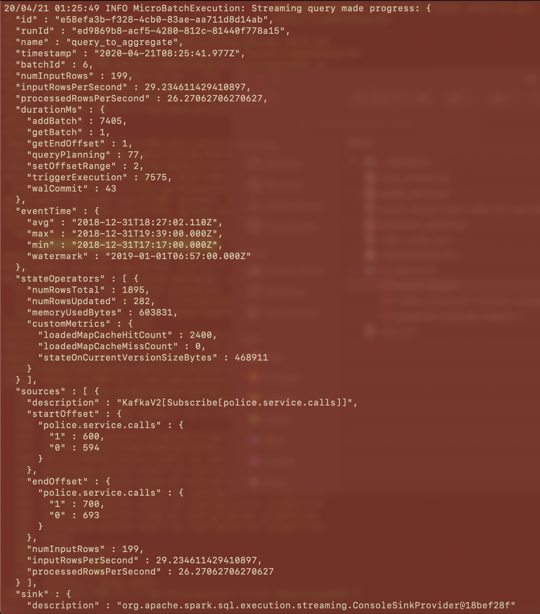
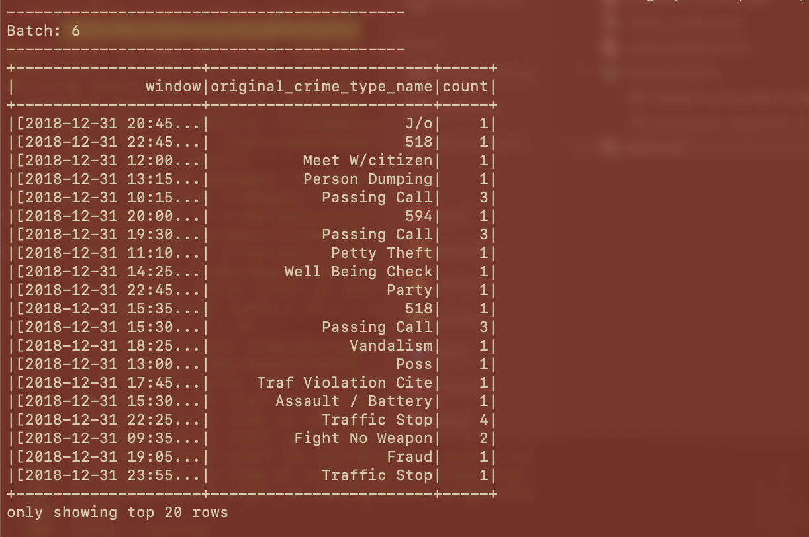

# SF Crime Statistics With Spark Streaming
Provide statistical analysis of San Francisco crime incidents data using Apache Spark Structured Streaming. Create a Kafka server to produce data, and ingest data through Spark Structured Streaming.

## Requirements
1. kafka_2.11-2.3.0
2. spark-2.4.5-bin-hadoop2.7
3. java 9.0.4
4. scala 2.11.12

## Run the Streaming application

1. Start Zookeeper: 
   /usr/bin/zookeeper-server-start config/zookeeper.properties

2. Start Kafka server: 
   /usr/bin/kafka-server-start config/server.properties

3. Ingest data into topic: 
   python kafka_server.py

4. Start kafka console consumer (pwd=<path-to-kafka>/kafka_2.11-2.3.0/bin): 
   kafka-console-consumer.sh --topic "police.service.calls" --from-beginning --bootstrap-server localhost:9092

5. Run Spark job (pwd=<path-to-project>/SF_Crime_Statistics_With_Spark_Streaming/sf-crime-data-project-files): 
   spark-submit --packages org.apache.spark:spark-sql-kafka-0-10_2.11:2.4.5 --master local[*] data_stream.py

## Screenshots 
Screenshots can be found in screenshots.zip

### Kafka Consumer Console Output

### Progress Reporter

### Count Output

## Questions of Step-3

1. How did changing values on the SparkSession property parameters affect the throughput and latency of the data? 
   Experimented with two SparkSession properties to get good throughput and low latency.  The properties are "maxOffsetsPerTrigger" and "maxRatePerPartition".  I referred to "processedRowsPerSecond", which is indicative of number of rows processed in a second. The higher the number, greater is the throughput and lower latency.
   
2. What were the 2-3 most efficient SparkSession property key/value pairs? Through testing multiple variations on values, how can you tell these were the most optimal? 
   Most efficient SparkSession properties were:
   1. spark.streaming.kafka.maxRatePerPartition => set the maximum rate for each partition.
   2. spark.default.parallelism
   3. spark.sql.shuffle.partitions  
   The goal I had is to get higher "processedRowsPerSecond".
